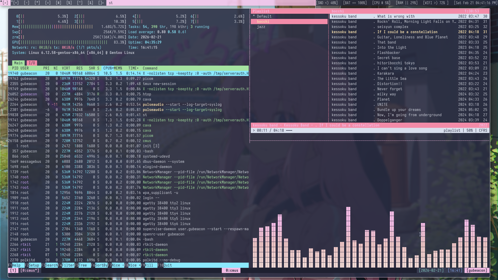
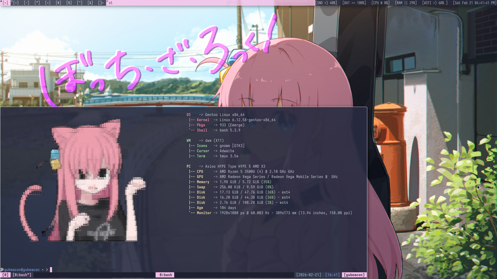

# My Dotfiles
# Colorscheme
This configuration mostly uses the catpuccin colorscheme with pink as the main color
# Components
1. suckless tools (repo is here: https://github.com/Cubeacon-sys/suckless)
2. nvim
3. picom
4. mpv
5. htop
6. fastfetch
7. cava
# screenshots

